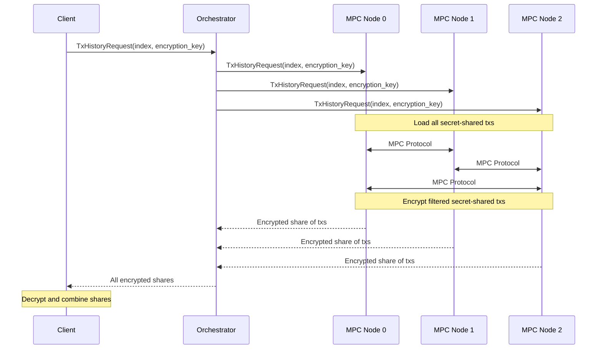

# Privacy-Preserving Compliance

Compliance on Merces lets regulated entities meet AML, sanctions screening, and lawful-disclosure obligations **without exposing plaintext user data**: not to the application, not to a third-party screening engine, and not to TACEO. 
It is built into the payment flow at the protocol layer by default and features can be called as needed. The construction is operator-blind: no single party (TACEO, node operators, the smart contract owner) holds plaintext data or can move funds unilaterally.

:::tip[Privacy and compliance tools can work well together]

Private payments cannot scale in regulated jurisdictions without compliance. The standard answer (run KYC and monitoring on plaintext, ship PII to third-party screening engines, log everything) is incompatible with privacy and security best practices. Privacy-preserving compliance is what makes private rails shippable in regulated markets at all.

:::

## Compliance splits in two

Compliance for private payments has two halves, and they sit on opposite sides of the transaction.

**Before a transaction settles, the question is whether it should happen at all.** Sanctions screening, AML checks, policy gating. This is enforcement, and it runs inside the protocol on every transfer. The slot that runs it is the **Compliance Engine**; Predicate is the default provider filling that slot today.

**After a transaction settles, the question is what happened.** An auditor inspects a transfer, a regulator issues a lawful demand, a compliance officer reviews a flagged payment. This is reveal of past activity, on request, to authorised parties. It runs through the **Compliance Dashboard** in the Merces app and has been live since March 2026.

A third concern, identity, sits outside the transaction loop entirely. KYC, sybil resistance, and credential verification are the responsibility of the B2B customer or of TACEO Identity, not of Merces. See [Identity, and what Merces does not do](#identity-and-what-merces-does-not-do).

:::info[How the Engine and Dashboard relate]

Another way to see the **Compliance Engine** is as Merces's canonical compliance component. It plugs in external compliance systems like Predicate to enforce policy before a transaction settles, and it offers the **Compliance Dashboard**, a UI where an authorised user requests decryption of specific past transactions, to view and access transaction data after settlement. The two sit at different points in the transaction lifecycle (enforcement before, reveal after) with different audiences, so the docs keep them apart throughout.

:::

## Pre-transaction enforcement

Merces was designed with a Compliance Engine: an architectural slot where a policy provider plugs in and checks transactions before they settle. The slot is pluggable, so any compatible provider can fill it. [Predicate](https://predicate.io) fills it today.

### How Predicate works

Predicate is [programmable compliance infrastructure](https://docs.predicate.io). It evaluates transactions against configurable **policies**: declarative rule sets covering AML and CFT screening, sanctions lists, KYC/KYB status, transaction rate limits, collateral thresholds, and jurisdictional restrictions. Each evaluation produces a cryptographically signed **policy attestation**, a data structure certifying whether the transaction satisfies the policy without revealing the underlying compliance data to the application.

The attestation carries four fields: a unique `uuid` (consumed on-chain to prevent replay), an `expiration` timestamp, the `attester` address, and a `signature`. Policies can be updated without redeploying contracts, so enforcement stays current as regulations change. The policy sits with the operator: Predicate enforces what the institution defines, on every transfer.

### Enforcement in Merces 2.1: the off-chain gateway check

In 2.1, enforcement runs through the gateway and covers [confidential transfers](https://docs.taceo.io/docs/finance-solutions/payments/introduction/#two-privacy-modes). When a user initiates a confidential transfer, the gateway submits a compliance request to the Predicate API (`https://api.predicate.io/v2/attestation`) before processing it:

```json
{
  "verification_hash": "x-abc123def456",
  "from": "<wallet address>",
  "chain": "ethereum"
}
```

A compliant response includes `is_compliant: true` and the attestation to forward on-chain:

```json
{
  "policy_id": "policy_abc123",
  "policy_name": "Standard AML Policy",
  "verification_hash": "x-abc123def456",
  "is_compliant": true,
  "attestation": {
    "uuid": "550e8400-e29b-41d4-a716-446655440000",
    "expiration": 1696640400,
    "attester": "0xf39Fd6e51aad88F6F4ce6aB8827279cffFb92266",
    "signature": "0x1b2c3d4e5f..."
  }
}
```

For a non-compliant wallet, some policies include a `reason` object explaining the failure. Both `code` and `message` are customizable when authoring a policy:

```json
{
  "policy_id": "x-dev-trm-risk-abc123",
  "policy_name": "TRM Risk Score",
  "verification_hash": "x-abc123def456",
  "is_compliant": false,
  "attestation": {
    "uuid": "550e8400-e29b-41d4-a716-446655440000",
    "expiration": 0,
    "attester": "",
    "signature": ""
  },
  "reason": {
    "code": "trm_high_risk",
    "message": "TRM risk score for this wallet is 10 which exceeds the maximum allowed of 7"
  }
}
```

If the wallet is non-compliant, the gateway rejects the transaction and returns the reason to the user. If compliant, the gateway proceeds.

### On the roadmap: contract-side verification

The end-state design moves attestation verification on-chain. The attestation is embedded in the transaction and validated by the **Predicate Registry** before the smart contract function executes, so the contract never runs without a valid, unexpired, policy-bound attestation:

```solidity
import {BasicPredicateClient} from "@predicate/contracts/src/mixins/BasicPredicateClient.sol";
import {Attestation} from "@predicate/contracts/src/interfaces/IPredicateRegistry.sol";

// Example of how the Merces contract can consume the attestation for a deposit function.
contract Merces is BasicPredicateClient {
    constructor(
        address _registry,
        string memory _policyID  // Use your verification_hash here
        ...
    ) {
        _initPredicateClient(_registry, _policyID);
        ...
    }

    function deposit(Attestation calldata _attestation, ...) external payable {
        require(_authorizeTransaction(_attestation, msg.sender), "Unauthorized");
        ...
    }
}
```

This path depends on the deployment chain supporting the Predicate Registry, which is why it is not yet enabled on the current testnet. The off-chain gateway check above is what enforces compliance in 2.1.

### How enforcement fits with the privacy modes

Predicate evaluates a policy against a wallet address, so it applies to **confidential transfers**, where sender and receiver addresses are visible on-chain. It does not apply to **private transfers**, where addresses are hidden by the protocol and the application never sees them. Compliance for the private mode is open research.

See [Two privacy modes](https://docs.taceo.io/docs/finance-solutions/payments/introduction/#two-privacy-modes) for a full breakdown of what each mode hides.

## Post-transaction reveal

By default, every Merces transaction is encrypted. The TACEO Network maintains the transaction graph in encrypted form, and only the parties to a transfer see its full details. The chain still carries a verifiable record of every state change (a cryptographic audit trail), and verifying that record does not require decrypting the data behind it.

When an authorised party submits a **decryption request** for a specific account, the MPC network nodes jointly approve and perform the decryption, returning that account's transaction history in plaintext. A **lawful disclosure** is the same machinery with a different trigger: a subpoena or court order rather than a routine compliance review. Requests are scoped, so they expose the selected data and nothing else.

The **Compliance Dashboard** at `merces.taceo.io/compliance` is the user-facing surface for this. An authorised user requests decryption of specific transactions for regulatory purposes, and no details beyond the requested transactions are exposed.

:::note[Public testnet vs. production]

On the [public Plasma testnet reference app](https://merces.taceo.io/compliance), anyone can try the decryption flow. In production deployments, access is restricted to explicitly authorized entities by policy and contract configuration.

:::

### How a decryption request works

A decryption request fans out across the MPC nodes. No single node can decrypt the history on its own; the plaintext only exists after the client recombines the encrypted shares the nodes return.



The orchestrator fans the request out to all three nodes, injecting a shared `session_id`. Each node returns its own encrypted share. The orchestrator assembles the three shares and returns them to the client, which decrypts and combines them to recover the plaintext history.

#### Orchestrator: `POST /history`

**Request** (`TxHistoryRequest`):

```json
{
  "index": 42,
  "encryption_key": "dGhpcyBpcyBhIDMyLWJ5dGUgcHVibGljIGtleSBmb3IgY3J5cHRvYm94",
  "start_time": "2026-01-01T00:00:00Z",
  "end_time": "2026-12-31T23:59:59Z"
}
```

- `index`: the account index whose history is being requested
- `encryption_key`: base64-encoded 32-byte `crypto_box::PublicKey`, supplied by the requester so the nodes can encrypt their shares to it
- `start_time` / `end_time`: optional RFC 3339 timestamps that bound the range

**Response** (`TxHistoryResponse`):

```json
{
  "transactions0": "3q2+7wAAAA==",
  "transactions1": "wvHi8wAAAA==",
  "transactions2": "ASNFZ4kA=="
}
```

Each field is a base64-encoded, CBOR-serialized `Vec<Transaction>`, encrypted with the requester's public key. The three fields hold the shares from node 0, node 1, and node 2 respectively.

#### Node: `POST /history`

Each node exposes the same route. The orchestrator's request to a node is identical to the client's, with one addition: a shared `session_id` that ties the three node responses to one request.

**Request** (`TxHistoryRequest`):

```json
{
  "index": 42,
  "encryption_key": "dGhpcyBpcyBhIDMyLWJ5dGUgcHVibGljIGtleSBmb3IgY3J5cHRvYm94",
  "session_id": "550e8400-e29b-41d4-a716-446655440000",
  "start_time": "2026-01-01T00:00:00Z",
  "end_time": "2026-12-31T23:59:59Z"
}
```

**Response** (`TxHistoryResponse`):

```json
{
  "transactions": "3q2+7wAAAA=="
}
```

A single base64-encoded encrypted CBOR blob: this node's share only.

## Identity, and what Merces does not do

Identity sits outside Merces. The compliance decision still belongs to a licensed provider: a KYC vendor, a screening engine, a VASP's compliance team. What Merces changes is **where the plaintext lives** and **who sees it**.

In the standard model, every application that needs a compliance signal pulls the user's full identity profile, hands it to a third-party API, and stores the result. Each new integration is another copy of the user's data and another surveillance vector.

TACEO's design for privacy-preserving KYC (MPKYC, currently at design stage) inverts that: a licensed provider attests to a property of the user **once**, and downstream applications query the attestation and receive a verifiable yes or no. No data shared, no copies created, no per-integration breach surface. MPKYC and related identity primitives are delivered through TACEO Identity, not through Merces.

The same cryptographic foundation underneath Merces compliance is the one TACEO co-architected for [World](https://world.org/)'s iris-code system, deployed in production at global scale as a GDPR remediation for biometric data. The protocol underneath Merces is the same kind of system, applied to financial flows.

## Transfer modes

| Term | What it means | Status |
| --- | --- | --- |
| **Confidential transfer** | Sender and receiver wallets are visible; amounts and assets are encrypted. | Live (native) |
| **Private transfer** | All transaction data is encrypted, including sender and receiver wallets. | Live (native); compliance integration open research |
| **Public/private boundary** | The moment funds move between a public ERC-20 balance and a Merces private balance. | Live (native) |
| **Operator-blind** | No single party holds plaintext data or can move funds unilaterally. | Live (native) |

## Who it's for

| Audience | How they use it |
| --- | --- |
| **Fintechs and stablecoin issuers integrating Merces** | Compliance is built into the payment flow they are already shipping. |
| **VASPs and regulated entities** | Meet AML, sanctions, and lawful-disclosure obligations on private rails without standing up surveillance infrastructure. |
| **Licensed KYC and screening providers** | Issue privacy-preserving attestations on top of existing diligence work, expanding reach without expanding data exposure. |
| **Compliance and policy teams** | Auditable, scoped lawful-disclosure paths that do not require the application to hold plaintext. |

## Next steps

- Read the [payments overview](/docs/finance-solutions/payments/introduction) to see how confidential transfers work end to end.
- Review [Predicate's policy documentation](https://docs.predicate.io) to understand the rules enforced before settlement.
- [Contact the team](mailto:hello@taceo.io) for production access and policy configuration.
