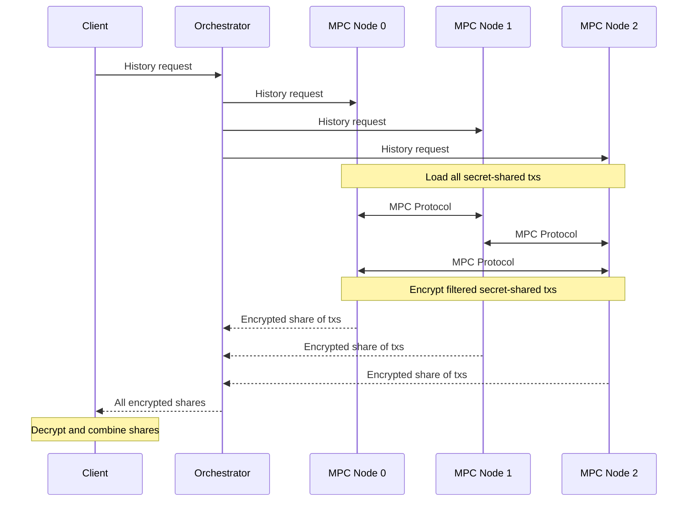

# Post-transaction disclosure

Every Merces transaction is encrypted by default. The TACEO Network holds the transaction graph in encrypted form, and only the parties to a transfer see its details. The chain carries a verifiable record of every state change — a cryptographic audit trail — and verifying that record does not require decrypting the data behind it.

Disclosure is therefore an explicit action, not a property of the ledger. No standing decryption capability exists, and no party holds one.

## How a disclosure happens

**1. Request.** An authorised party enters the target wallet address in the Compliance Dashboard to initiate the decryption protocol.

**2. Approval.** Each node on the network verifies and approves the request before decryption can proceed. No single node can decrypt on its own.

**3. Reveal.** The decrypted transaction history is returned to the requester, scoped to what was asked for and nothing else.

A **lawful disclosure** — triggered by a subpoena or court order rather than a routine compliance review — is the same machinery with a different trigger.

## Threshold decryption

The mechanism underneath is threshold decryption. The request fans out across the nodes, each returns its own encrypted share, and the plaintext only exists once the requester recombines them. The requester supplies a public key with the request, so each node encrypts its share to the requester alone. A request can be bounded by a start and end time.

The orchestrator fans the request out to the nodes, tying their responses to a single session, then assembles the returned shares and passes them back to the requester.

## The Compliance Dashboard

The Compliance Dashboard at `merces.taceo.io/compliance` is the user-facing surface. An authorised user requests decryption of specific transactions for regulatory purposes, and nothing beyond those transactions is exposed.

:::note Public testnet vs production
On the public testnet reference app the decryption flow has no access control: anyone can query any account's transaction history. This is for demonstration only. In production deployments, access is restricted to explicitly authorised entities by policy and contract configuration.
:::
