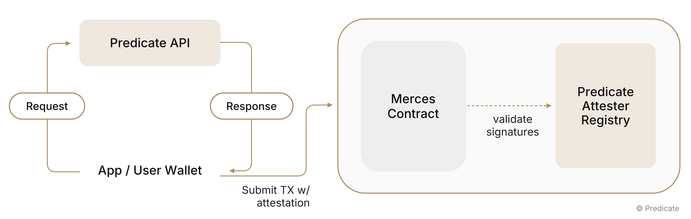

# Pre-transaction screening

Merces has a **Compliance Engine**: an architectural slot where a policy provider plugs in and evaluates transactions before they settle. The slot is pluggable — any compatible provider can fill it — and [Predicate](https://predicate.io) fills it today.

## Scope

Screening runs per transaction on deposits, withdrawals and **confidential transfers**, where sender and receiver addresses are visible onchain.

It does not apply to **private transfers**. The protocol hides those addresses from the application, and a policy is evaluated against an address. Compliance for the private mode is open research.

## What Predicate evaluates

Predicate is programmable compliance infrastructure. It evaluates transactions against configurable **policies**: declarative rule sets covering AML and CFT screening, sanctions lists (OFAC, EU, UK, UN), KYC and KYB status held by the integrating business, transaction rate limits, collateral thresholds, jurisdictional restrictions, and operator-defined allowlists and blocklists.

Each evaluation produces a cryptographically signed **policy attestation**, certifying whether the transaction satisfied the policy without revealing the underlying compliance data to the application. The attestation carries a unique identifier that prevents replay, an expiry, the attester's address and a signature.

Policies can be updated without redeploying contracts, so enforcement stays current as regulations change. The policy belongs to the operator: Predicate enforces what the institution defines, on every transaction in scope.

## How enforcement runs

The gateway requests an attestation from Predicate before processing a transaction, and proceeds only on a compliant response. A non-compliant response stops the transaction; policies can be authored to return a reason for the failure.

Verification of that attestation onchain — the Merces contract checking Predicate's signature directly, rather than the gateway checking it offchain — depends on the deployment chain supporting the Predicate Registry, and is pending that support.

## What the screening provider sees

The provider evaluates a policy against a wallet address. It does not learn what the user is doing: the amount, the asset and the counterparty stay encrypted, and no plaintext transaction data is shared with it.
