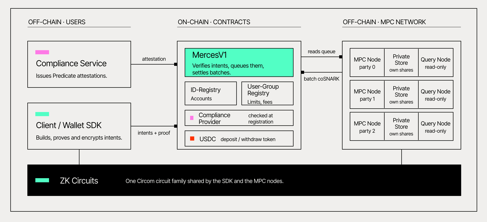
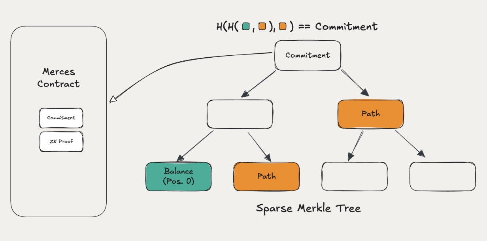

# Architecture

Merces holds account balances as secret shares across the TACEO Network, with a commitment onchain. Every state transition is proven with a coSNARK: the network updates balances it cannot see, and anyone can verify the update was correct. The storage structure differs by transfer mode.

Further information on the building blocks can be accessed here:
- [Compliance Service](/docs/finance-solutions/compliance/overview)
- [Client/Wallet SDK](/docs/finance-solutions/integrate/client-sdk)
- [MPC Network](/docs/taceo-network/)
- [ZK Circuits](/docs/overview)

## Storage

**Partial-private transfer.** The Merces contract holds `mapping(address => Commitment)`. The network holds `mapping(address => ([balance], [randomness]))`, keeping secret shares of both — the randomness is what's needed to compute the commitment. Users register deposits, withdrawals and transfers with the contract; the network processes them in batches and posts the ZK proof and updated commitments onchain. Reading a balance goes directly to the network and needs no proof: the account holder verifies it against the onchain commitment.

**Private transfer (default).** Balances sit in a Merkle tree whose root is a single sparse onchain commitment covering the entire map. Individual per-account commitments aren't used — watching which one changed would reveal sender and recipient. Leaves store balance commitments, and the wallet addresses and tree indices involved in a transfer are revealed to the node operators, so the tree can be computed in plaintext at the operator layer. That is the trade behind this tier's throughput: the transaction stays private to an onchain observer, and the operators see the graph.

**Graph-private transfer.** The same tree, with every layer implemented as an [oblivious RAM (ORAM)](/docs/services/taceo-omap/overview). Access is oblivious, so the operators don't learn which leaves were touched either.

## Executing a transfer

In the tree-based modes, a transfer is a map update: deduct from the sender's leaf, add to the recipient's. An address's path from root to leaf is its position in the tree, which is what makes membership proofs — and therefore state-transition proofs — efficient.

Each transfer produces four Merkle proofs, for the old and new balances of both sender and recipient, along with proofs that the sender was solvent and the amount positive. Checking a balance is a read from the map.

## Proving with coSNARKs

Generating a ZK proof has normally meant a choice: prove on the user's own device, which is private but heavy for phones and browsers, or send the job to a proof market, which is fast but hands a third party the private data.

Collaborative SNARKs remove the choice. The proving work is split across multiple parties using MPC, each computing only on an encrypted share, so the witness is never reconstructed by any single party. The output is a standard, byte-identical Groth16 proof — existing verifiers work unchanged.

Proving has two steps, witness extension and proof generation. Proof generation is the heavier of the two, roughly 5x the memory. Either or both can be delegated.

For Merces, the coSNARK proves that the involved commitments were updated correctly and that the sender had sufficient balance.

## What this buys

**Compute integrity that is proven, not assumed.** The network cannot produce an invalid state transition and have it accepted — the proof is checked onchain like any other ZK proof. Privacy holds unless more than the threshold of operators collude; correctness is cryptographic either way.

**Onchain privacy.** What each mode reveals, and to whom, is set out in [Who sees what](/docs/finance-solutions/concepts/who-sees-what).

**Speed.** Collaborative proving gets proof-market performance without exposing plaintext data to the prover. Current throughput per mode is in [Privacy model](/docs/finance-solutions/concepts/privacy-model).
