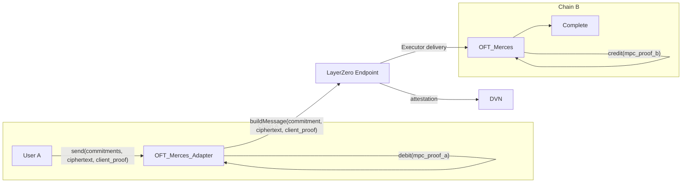

# Cross-chain transfers
The future is cross- and multi-chain. Assets will not be bound to a single chain, but move freely across instances. 
There are already a plenty of solutions addressing inter-chain connections by bridging assets over. All of these transactions are public and traceable by any onchain observer.
Merces is about to change that by introducing **private cross-chain transfers**.

## How it works
Merces cross-chain transfers use **LayerZero's [OFT](https://docs.layerzero.network/v2/home/token-standards/oft-standard) Adapter** pattern, with `_debit` and `_credit` altered to operate on commitments and ciphertext instead of plaintext amounts. A transfer moves value from a private balance on one chain to a private balance on another without revealing transactions details like sender, recipient or amount.

## Standard OFT

A standard OFT transfer exposes the amount at every layer of the stack: `send()` calldata carries `amountLD`, the LayerZero packet payload encodes `amountSD`, DVN attestations hash a plaintext payload, and `_credit()` mints a visible amount on the destination chain.
Merces solves privacy within a single chain — encrypted balances held by MPC, batched processing, ZK proofs — but moving a balance between chains conventionally means moving to a public account first. With the combination of Merces and LayerZero's OFT the end-to-end lifecycle of a crosschain-transfer turns private.

## Architecture

Two variants of the adapter are deployed:

**`OFTMercesAdapter`** wraps the existing Merces private balance state on the chain holding the underlying ERC-20. Its `_debit` locks the sender's private balance via MPC, producing `mpc_proof_a`. Its `_credit` handles value returning to this chain: MPC credits the receiver's encrypted balance, which the holder can then withdraw to public ERC-20 through a standard Merces withdrawal.

**`OFTMerces`** handles the other chains. It receives cross-chain messages and credits the recipient's private balance via MPC, producing `mpc_proof_b`. Its `_debit` burns the sender's private balance on outbound sends.

The standard OFT envelope — peer wiring, fee quoting, DVN verification, Executor delivery — is preserved unchanged. Because LayerZero fees are based on message size and destination-chain gas rather than transfer amount, and the commitment and ciphertext payload is fixed-size at roughly 1.2 kB, fees don't vary with the value being moved.

Each participating chain runs the standard Merces setup alongside the adapter: one ID registry for account signup and one three-party MPC network processing requests.

## Cross-chain transfer flow

**1. Client-side preparation.** The sender generates an amount commitment, `Poseidon2(amount, r)`, encrypts the amount into shares for the MPC parties as a BabyJubJub ElGamal ciphertext, and generates a client ZK proof attesting that the commitment and ciphertexts are well-formed and the amount is range-checked. They also generate a sender commitment and a receiver commitment for the recipient on the destination chain.

**2. Send.** The sender calls `send()` on the adapter with the destination endpoint ID, the commitments, the ciphertext and the client proof. The contract verifies the client proof onchain.

**3. Debit.** The MPC network decrypts the sender's ciphertext shares, verifies sufficient balance, decrements the sender's encrypted balance, and produces `mpc_proof_a`, a coSNARK proving the balance transition. The contract verifies it onchain. If the debit fails, due to insufficient balance or an invalid proof, the send aborts.

**4. Cross-chain message.** The adapter builds the LayerZero payload from the commitments, ciphertext and client proof, and dispatches it with `_lzSend()`. The payload carries no plaintext amount.

**5. Credit.** On arrival, the client proof is verified again, `_lzReceive()` decodes the payload and enqueues it for MPC processing. The MPC network decrypts the ciphertext shares, computes the new balance commitment with Poseidon2 inside MPC, updates the receiver's entry in the destination chain's MPC state, and produces `mpc_proof_b`. The contract verifies that proof and applies the updated commitment.

**6. Result.** The receiver holds a credited balance commitment on the destination chain. No plaintext amount has appeared in any calldata, packet, event, or onchain state on either side.

:::info Verifiable interactions
The client proof verified on both chains guarantees the commitment and ciphertext are well-formed, which is what ensures the destination credit cannot fail: the MPC network on the destination chain will always be able to decrypt and credit the correct amount.

:::

## Minting

A credited balance is not a minted token yet. The receiver sees the credit and can transact against it privately, but `mint()` is only called when they withdraw from their private balance to a public one. Until then the receiver holds a right to mint.

## Privacy comparison

| | Standard OFT | Merces OFT Adapter |
|---|---|---|
| `send()` calldata | Plaintext `amountLD` | Commitments, ciphertexts, client proof |
| `_debit()` | Burns or locks a plaintext amount | MPC debit on the encrypted balance, verified via `mpc_proof_a` |
| LayerZero packet payload | `abi.encode(amountSD, to)` | Commitments, ciphertext, client proof |
| DVN attestations | Hash of a plaintext payload | Hash of the commitment payload |
| `_credit()` | Mints or unlocks a plaintext amount | MPC credit on the encrypted balance, verified via `mpc_proof_b` |
| Events | `SendToChain(amount)` | Commitment only |

