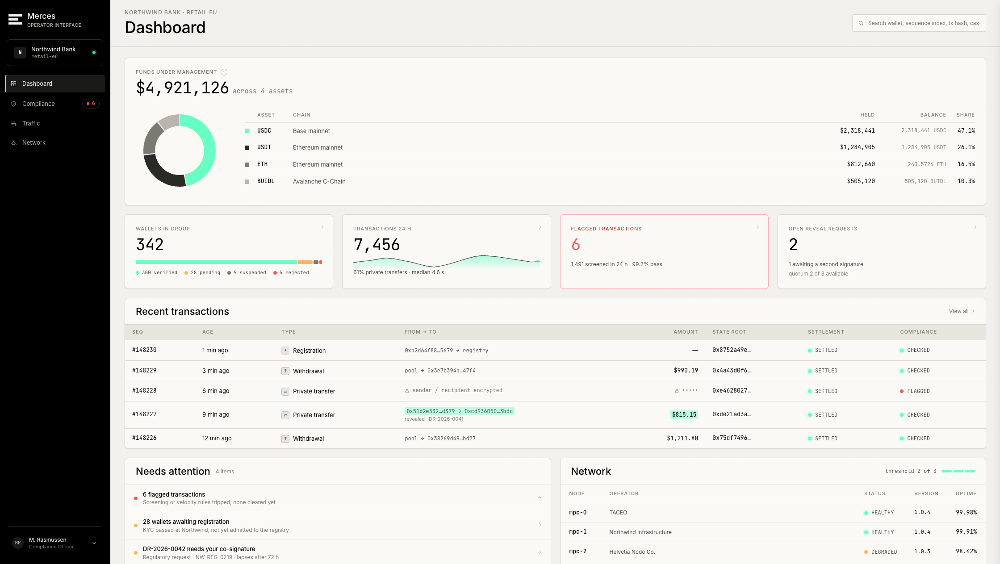
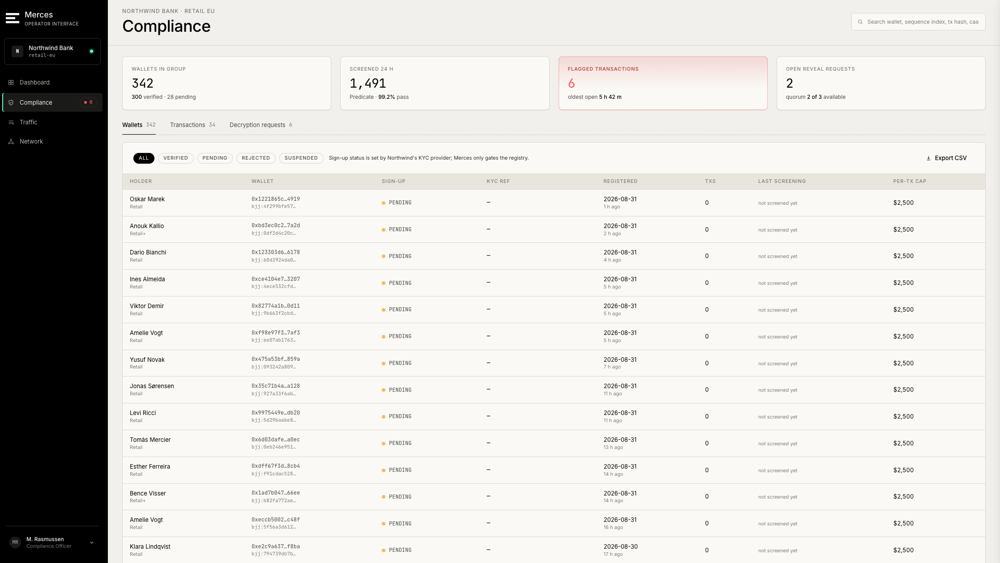

# Operator & admin interface

{/* TODO(lukas): add a (preview) screenshot of how the interface we'll look like */}

:::note Prototype
The operator console is an interactive prototype, not a deployed product. The views and workflows below show the intended interface; they are not available to use today.
:::

The operator console is a browser interface for running a Merces deployment: watching transactions settle, managing compliance policy, checking the health of the node set, and making disclosure requests. It is intended as the alternative to building those views yourself against the SDK.

It is multi-tenant and role-aware — a compliance officer at one institution sees that institution's traffic and holders, not the whole network.

## Dashboard

The landing view: recent transactions, and anything needing attention — wallets awaiting admission to the registry, disclosure requests in flight, nodes reporting degraded health.

## Traffic

A live feed of transactions with sequence number, age, sender and recipient, amount, chain, compliance outcome and settlement state.

Opening a transaction shows three layers: the protocol view (what kind of operation it was and how it settled), the payload, and the compliance record for that specific transaction.

## Compliance

Three things live here.

**Disclosure policy** — who may request decryption, on what basis, and how requests are authorised.

**Limits and lists** — per-transaction caps, allowlists and blocklists, screening provider and the last screening result per holder.

**Operator seats** — which people hold operator or compliance-officer roles in this tenant.

Opening a holder shows their identity record, their registration and KYC reference, their balance, and the transactions linked to them that are in scope for the viewer.

## Network

The MPC node set and the history node set, each node with its operator, health, median serve latency, share of reads, and how much share data it holds. There is a separate view for supporting services.

A node's detail view shows its deployment, round latency over the last day, and — usefully — an explicit statement of what that node can see. Nodes hold shares, not balances, and the console says so per node rather than leaving it to be inferred.

## Deployment

The chains and assets this deployment covers: chain, chain ID, RPC endpoint, pool contract, pool balance and admin wallet. RPC endpoints can be added here.

## Making a disclosure request

The disclosure flow runs in three steps.

**Scope** — name the wallet and the transactions in scope, with a case reference and the legal basis for the request. Scope is enforced cryptographically rather than by policy: the nodes cooperate on the in-scope records only.

**Authorisation** — the request is signed before it is fanned out to the nodes.

**Execution** — the nodes each verify and approve, then cooperate on the decryption. The console shows the request running and the threshold reached before the result is available.

Nothing here creates a standing capability. There is no key that, once issued, lets a holder decrypt at will — each request is authorised and executed on its own, and revealed plaintext is not stored server-side. See [Post-transaction disclosure](/docs/finance-solutions/compliance/post-transaction-disclosure) for the mechanism underneath.
