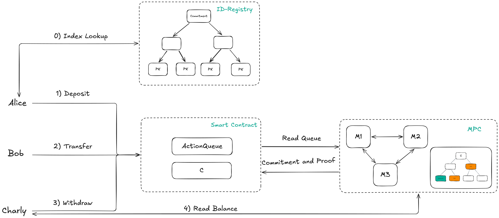
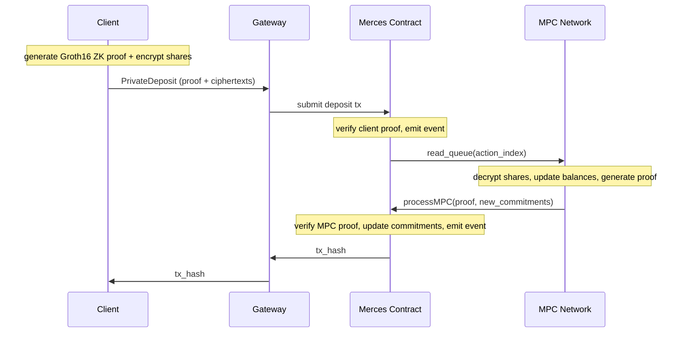

# How it works

Private Payments uses a combination of ZK proofs and MPC-held secret shares to keep balances and
transfer amounts private while settling on a public chain. This page describes each component
and walks through a deposit end-to-end.

## Components

**Client.** The application or wallet initiating transactions using the Merces SDK. It generates ZK proofs locally and
holds the private key — all cryptographic operations happen on the client before any network call
is made.

**Gateway.** The offchain coordinator that receives client requests over WebSocket, submits
transactions to the Merces contract, and returns the final transaction hash once the MPC network
has finalised the balance update.

**Id Registry.** The registry for mapping wallet addresses to indices in the Oblivious Merkle Tree.
Client registers a commitment to their wallet and gets a inclusion proof needed for private transactions.

**MPC network.** A committee of three operators that hold balances as additive secret shares. No
single operator ever sees a plaintext balance or transfer amount. The network reads queued actions
from the contract, runs an MPC protocol to update shares, generates a proof of correct execution,
and calls back into the contract.

**Merces contract.** Stores balance commitments onchain, verifies the client's Groth16 proof when
an action is submitted, enqueues the action for the MPC network, and verifies the MPC network's
proof when the balance update is finalised.

## Transaction flow

A deposit moves ERC-20 tokens from a user's public wallet into their private Merces account. The
sequence below shows a `privateDeposit` — the `confidentialDeposit` path is identical except the
sender address remains visible onchain.

### Step by step

**1. Proof generation (client-side).** The client splits the deposit amount into three additive
secret shares, encrypts each to the corresponding MPC operator's public key, and generates a
Groth16 ZK proof that the shares are consistent with the committed amount. This step is fully
local — no network call is made yet.

**2. Submission.** The client sends the proof and ciphertexts to the gateway over WebSocket. The
gateway constructs and submits the deposit transaction to the Merces contract.

**3. Onchain verification.** The contract verifies the Groth16 proof, records the new commitment,
and emits an event that signals the MPC network to pick up the queued action.

**4. MPC balance update.** The three operators jointly decrypt the ciphertexts to recover the
deposit amount, update the user's secret-shared balance, and generate a second Groth16 proof that
the update is correct. They call `processMPC()` on the contract with the proof and updated
commitments.

**5. Finalisation.** The contract verifies the MPC proof and commits the new balance state. The
transaction hash is returned through the gateway to the client.

Withdrawals and transfers follow the same structure. For transfers, the MPC network additionally
updates the receiver's balance shares in the same round.

