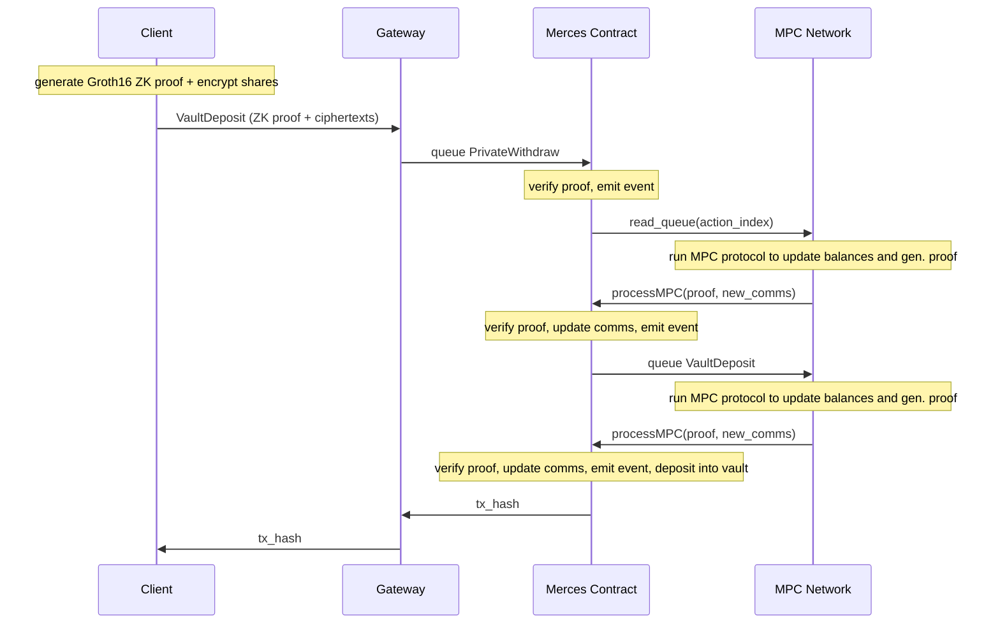
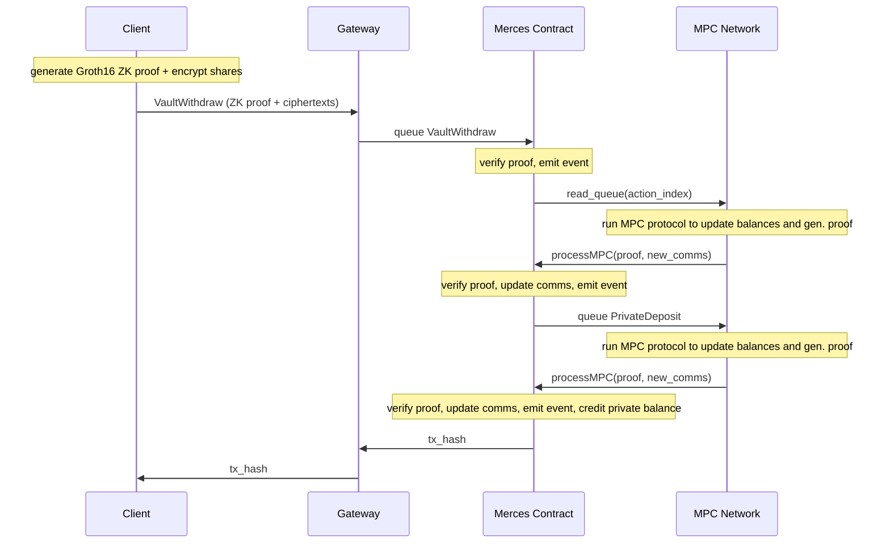

# Private yield

Private yield lets users put assets held in a private Merces balance to work. Funds move from the private account into a vault that accrues yield over time, without exposing positions, amounts, or counterparty relationships onchain.

## How it works

The vault is an [ERC-4626](https://eips.ethereum.org/EIPS/eip-4626) contract whose internal balances are held as secret shares across the TACEO network, exactly like private account balances. Neither the balance nor the yield accrual is ever written to the chain in plaintext.

A position is represented as vault shares. Shares change in value as the vault's underlying pool changes, but the share count and its underlying value stay private.

In practice:

1. A user holds a private token balance in their Merces account.
2. They deposit into the vault: the private token balance decreases, the private share balance increases.
3. The vault pool grows over time, and with it the redemption value of each share.
4. On redemption, shares are burned and tokens are credited back to the private Merces balance at the current conversion rate.

At no point is a plaintext balance or share count visible onchain or to any single party.

:::tip Token support
The description below uses one token throughout for simplicity. The vault standard and private yield support any token.
:::

## Components

| Component | Description |
|---|---|
| **Private balance** | The user's Merces account — the source for vault deposits and destination for redemptions |
| **Vault contract** | ERC-4626 contract that issues shares and holds the yield pool |
| **MPC network** | Holds vault balances as secret shares across the operators; no single operator sees a share count or its redemption value |
| **Gateway** | Accepts vault deposit and redemption requests, coordinates proof generation and the MPC update, and returns the transaction hash |

## Vault deposit

A vault deposit moves funds from a private balance into the vault. From the user's perspective it is atomic: the private balance decreases, the vault share balance increases. Underneath it is two chained Merces actions — a private withdraw, then a vault deposit.

1. The client generates a ZK proof and encrypted shares and posts them direclty to the contract or use the gateway over WebSocket.
2. The gateway submits the transaction to the Merces contract.
3. The MPC network processes the transition and withdraws the amount from the user's private balance.
4. Once the contract has processed that withdraw, it queues a second action to deposit the amount into the vault.
5. The MPC network processes the vault deposit, updating the user's vault share balance.
6. The gateway returns the transaction hash to the client.

## Vault redemption

A redemption burns vault shares and credits tokens back to the private balance at the current conversion rate, including any yield accrued while the shares were held. It runs as the mirror of a deposit: a vault withdraw, then a private deposit.

1. The client generates a ZK proof and encrypted shares and sends them to the gateway over WebSocket.
2. The gateway submits the transaction to the Merces contract.
3. The MPC network processes the transition and redeems the shares from the user's vault balance.
4. Once the contract has processed that withdraw, it queues a second action to credit the amount to the private balance.
5. The MPC network processes the private deposit, updating the user's private balance.
6. The gateway returns the transaction hash to the client.

## Privacy
Token positions and vault shares are held privately in the Merces contract. An onchain observer can not link a token balance to a specific user wallet.
Since the vault itself is a public contract the deposit to / withdraw from the vault is also a public transaction. However, the transaction is triggered by the Merces contract and does not reveal on behalf of which user it acts. 