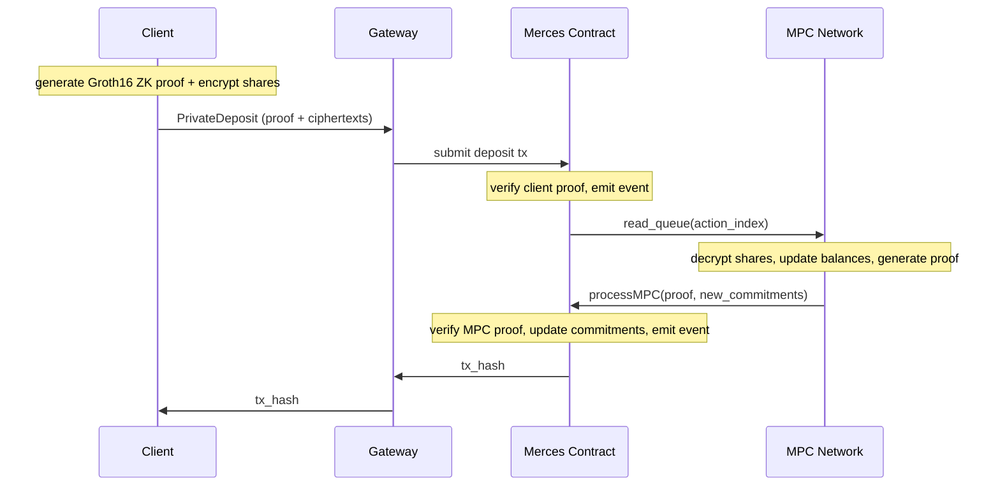

# Deposit & withdraw flows

Deposits move ERC-20 tokens from a public wallet into a private virtual account. Withdrawals move them back out. These are the two points where value crosses between the public token and its private form.

## Deposit

A deposit follows the same five steps as any Merces action:

1. **Proof generation, client-side.** The client splits the deposit amount into three additive secret shares, encrypts each to the corresponding MPC operator's public key, and generates a Groth16 proof that the shares are consistent with the committed amount. This step is fully local.
2. **Submission.** The client sends the proof and ciphertexts to the gateway over WebSocket; the gateway constructs and submits the deposit transaction to the Merces contract.
3. **Onchain verification.** The contract verifies the Groth16 proof, records the new commitment, and emits an event signalling the MPC network to pick up the queued action.
4. **MPC balance update.** The three operators jointly decrypt the ciphertexts to recover the deposit amount, update the user's secret-shared balance, and generate a second Groth16 proof that the update is correct. They call `processMPC()` on the contract with the proof and updated commitments.
5. **Finalisation.** The contract verifies the MPC proof and commits the new balance state. The transaction hash returns through the gateway to the client.

In confidential mode the path is identical; the sender address stays visible onchain.

## Withdraw

A withdrawal follows the same structure in reverse: the client proves entitlement to the amount, the contract verifies and queues the action, the MPC network debits the secret-shared balance and proves the update, and the contract releases the ERC-20 back to the public wallet.

