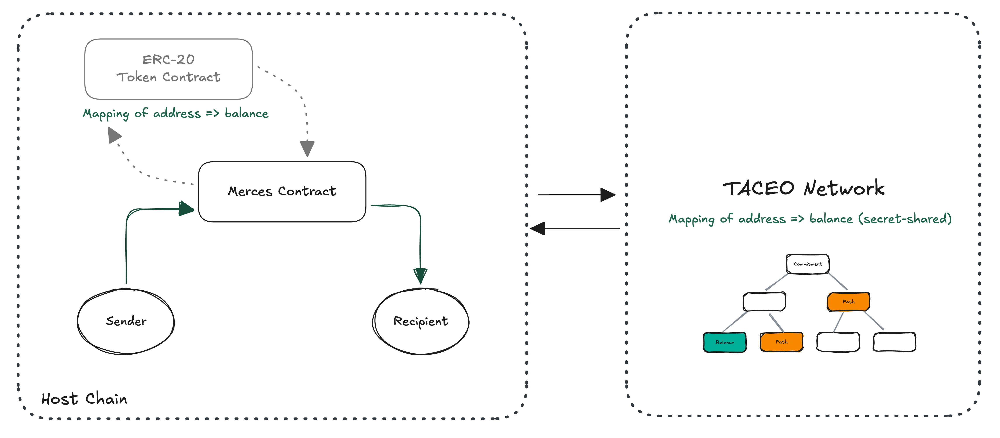

# Private virtual account

A private virtual account holds tokens as an encrypted balance on the same chain the user is already on. It can run standalone, as the user's only account, or sit alongside their existing public balance in the same wallet.

Merces wraps any existing token (e.g. ERC-20 like USDC or USDT) into a private form. The token, the chain, the wallet and the RPC all stay the same. There is no bridge, no new consensus, no migration.

## What the account holds

The balance is held as secret shares across the TACEO Network's MPC operators, with a commitment onchain. No single party, TACEO included, sees a plaintext balance or amount. The account owner sees their own balance; everyone else sees a single commitment.

Tokens enter the account by deposit from a public balance and leave by withdrawal back to one. Between those two points, value moves privately.

## What it supports

From the account, a user can:

- Send tokens privately to another wallet
- Hold a balance alongside a public one in the same wallet
- Pay from the private balance by card, via a card provider
- Put the balance to work in DeFi — yield, swaps, LPing and staking

For organisations, the same account underpins batch payments for payroll and contractors, treasury movements, fiat on and off ramps, agentic payments, and RWA tokenization.

## How it is integrated

The integration model is through APIs and SDK. Stablecoin issuers, fintechs and payment infrastructure builders white-label Merces into their own products, embedded via the client SDK and managed through an operator interface. End users never have to get direclty in touch with TACEO Merces.

## How it works - Components

**Client.** The application or wallet using the Merces SDK. Generates ZK proofs locally and holds the private key — every cryptographic operation happens before any network call.

**Gateway.** The offchain coordinator. Receives client requests over WebSocket, submits transactions to the Merces contract, and returns the transaction hash once the MPC network has finalised the update.

**ID registry.** Maps wallet addresses to indices in the oblivious Merkle tree. A client registers a commitment to its wallet and receives the inclusion proof needed for private transactions.

**MPC network.** Three operators holding balances as additive secret shares. They read queued actions from the contract, run the MPC protocol to update shares, prove correct execution, and call back into the contract. No single operator sees a plaintext balance or amount.

**Merces contract.** Stores balance commitments, verifies the client's Groth16 proof on submission, queues the action, and verifies the network's proof on finalisation.

## Next

- [Deposit & withdraw flows](/docs/finance-solutions/private-virtual-account/deposit-and-withdraw) — getting value in and out
- [Transfers](/docs/finance-solutions/private-virtual-account/transfers) — sending from the account
- [Transaction history & disclosure](/docs/finance-solutions/private-virtual-account/transaction-history) — what the owner sees, and what can be revealed
- [Architecture](/docs/finance-solutions/concepts/architecture) — how balances are stored and proven
