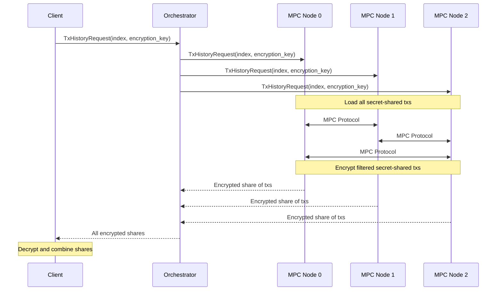

# Transaction history & disclosure

Every Merces transaction is encrypted by default. The TACEO Network maintains the transaction graph in encrypted form, and only the parties to a transfer see its details. The chain carries a verifiable record of every state change, and verifying that record does not require decrypting what sits behind it.

## Reading your own history

An account owner retrieves their history by requesting it from the network and decrypting it locally. No single node can produce the plaintext: the request fans out across all three, each returns its own encrypted share, and the client recombines them.

The requester supplies a public key with the request, so each node encrypts its share to the requester alone. The range can be bounded by start and end timestamps.

## Disclosure to an authorised party

The same machinery serves compliance review and lawful disclosure. An authorised party submits a decryption request for a specific account; the MPC nodes jointly approve and perform the decryption, returning that account's history in plaintext. Requests are scoped, so they expose the selected data and nothing else — the difference between a routine compliance review and a lawful disclosure is the trigger, not the mechanism.

The Compliance Dashboard is the user-facing surface for this.

:::note Public testnet vs production
On the public testnet reference app the decryption flow has no access control: anyone can query any account's history. This is for demonstration only. In production deployments, access is restricted to explicitly authorised entities by policy and contract configuration.
:::

[Compliance](/docs/finance-solutions/compliance/overview) covers the full picture, including pre-transaction screening.
