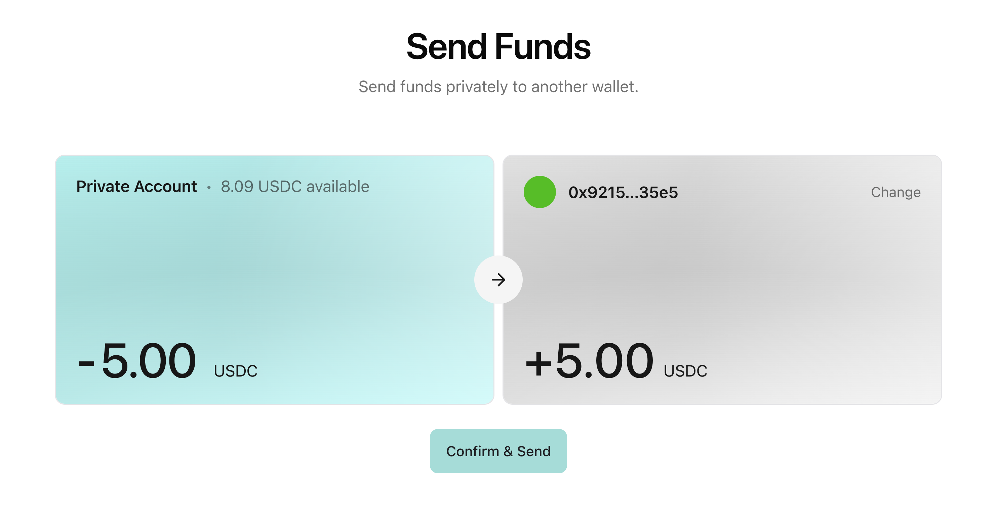

# Transfers

A transfer moves value from one private virtual account to another, while the publicially viewable token balance remains unchanged.
The sender sets the recipient, how much should be transferred and to whom. The transaction data is encrypted leaving no visible onchain trail. 

The below example from TACEO's internal payment app, demonstrates how Merces could be integrated in a retail-focused interface.

## What a transfer looks like

A sender holding a private balance of 955 USDT selects a recipient and an amount of 42 USDT, signs, and Merces executes. Afterwards the sender's balance is 913 USDT and the recipient's has grown by 42.

Neither balance is public. The recipient learns the amount they received, because they are a party to the transfer; they do not learn the sender's balance. An observer learns neither, and in private mode does not learn who transacted at all.

## How a transfer settles

The client generates the proof locally, then the transfer runs through the same path as any other Merces action: Refer to [Deposit & withdraw flows](/docs/finance-solutions/private-virtual-account/deposit-and-withdraw) for more details.
