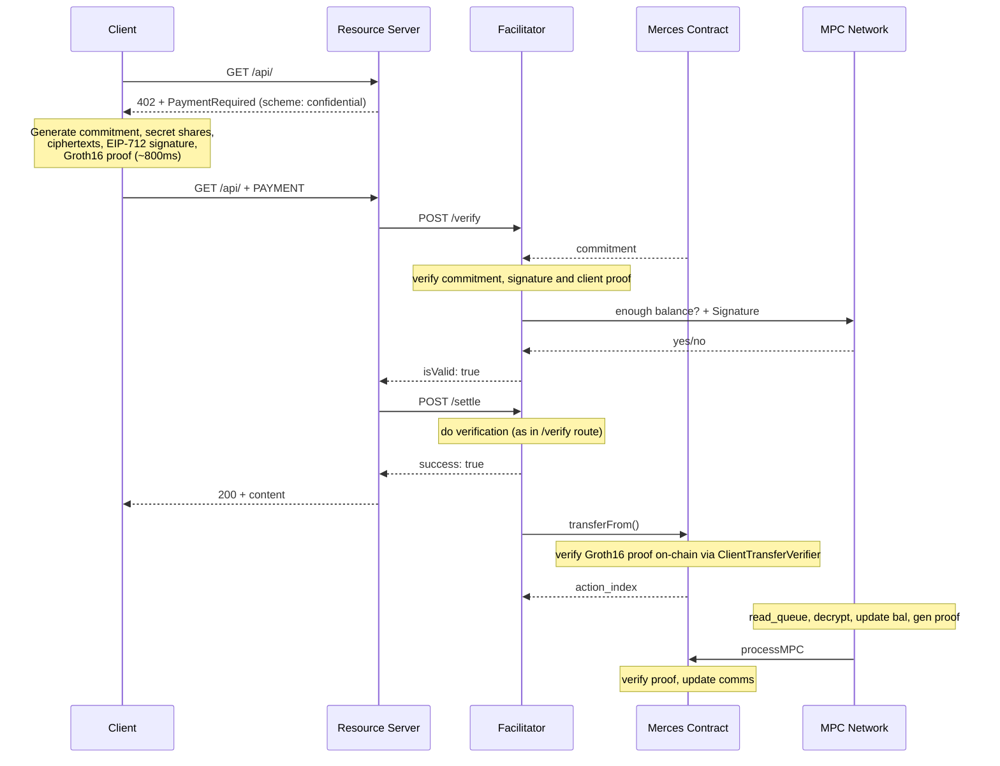

# How it works

A Confidential x402 payment flows through five components. This page describes each component's
role and walks through a full payment end-to-end.

## Components

**Client** — the agent or application making the API request. It holds the private key to the spending wallet, generates
the ZK proof, and constructs the payment payload. The client library handles all cryptographic
operations; the client application only needs to register the scheme and make HTTP requests as
normal.

**Resource server** — the API provider. It issues `402 Payment Required` responses, forwards
payment payloads to the facilitator for verification, and serves content on success. Apart from
advertising `scheme: "confidential"` in its payment requirements, it behaves identically to a
standard x402 resource server.

**Facilitator** — an off-chain service that verifies payment proofs and routes settlements. It
checks the ZK proof, validates the EIP-712 signature, queries the MPC network for balance
sufficiency, and submits the settlement transaction on-chain. TACEO operates a facilitator that can be
used directly.

**MPC network** — a committee of three operators that collectively hold secret-shared balances. No
single operator ever sees a plaintext balance or payment amount. The network answers
yes/no affordability queries during verification and processes transfers during
settlement.

**Merces contract** — Stores balances in encryped form (i.e., commitments), verifies
the client's Groth16 proof on-chain during `transferFrom`, enqueues transfer actions for the MPC
network, and verifies the MPC's proof when the balance update is finalised.

## Sequence diagram

## Payment flow

### Phase 1 — Discovery

The client sends an unauthenticated HTTP request to a protected endpoint. The resource server
checks its configuration, finds no valid payment attached, and responds with `HTTP 402 Payment
Required`. The response has a `PAYMENT-REQUIRED` header, containing the  base64-encoded `PaymentRequired` payload advertising the
`confidential` scheme, the required token and amount, the recipient address, and the MPC network's
current public keys.

### Phase 2 — Payment construction

The client builds the payment payload locally. No network calls are required for this step.

1. Generate a random blinding factor `r`.
2. Compute a **Poseidon2 commitment** to the amount: `commit(amount, r)`.
3. Split the amount into three additive secret shares — one per MPC operator.
4. Encrypt each share to the corresponding operator's BabyJubJub public key using ECDH.
5. Generate a **Groth16 ZK proof** that proves all of the above is consistent:
   - The commitment is the hash of the true amount and blinding factor.
   - The three shares sum to the committed amount.
   - Each share is correctly encrypted to the stated operator key.
   - The amount fits in 80 bits.
6. Sign the full payload with **EIP-712** — binding sender, receiver, commitment, ciphertexts, nonce, and deadline.
7. Re-send the original request with a `PAYMENT-SIGNATURE` header containing the encoded payload.

### Phase 3 — Verification

The resource server decodes the payment signature and forwards it to the facilitator's `/verify`
endpoint. The facilitator runs a series of checks:

- **Schema match** — the accepted scheme matches `"confidential"`.
- **Recipient match** — `payload.to` equals the resource server's address.
- **Deadline** — the payment has not expired.
- **Nonce** — not already used on-chain.
- **Amount commitment match** — random blinding factor `r` and `amount` produce the provided commitment
- **Signature** — the EIP-712 signature recovers to the claimed sender.
- **ZK proof** — the Groth16 proof is valid against 15 public signals (sender key, commitment, ciphertexts, MPC keys).
- **Balance** — the facilitator queries all three MPC nodes; they collectively confirm the sender holds sufficient funds without revealing the balance to anyone.

If all checks pass, the facilitator returns `{ isValid: true }` to the resource server.

### Phase 4 — Content delivery & settlement

On a valid response, the resource server immediately returns `HTTP 200` with the requested content.
Settlement is asynchronous — the client already has its response.

The resource server then calls the facilitator's `/settle` endpoint. The facilitator calls
`transferFrom()` on the Merces contract, passing the proof and ciphertexts. The contract verifies
the proof on-chain and enqueues a transfer action.

The MPC network picks up the queued action, decrypts the secret shares to recover the actual
amount, verifies the commitment, updates both parties' balance commitments, and generates a second
ZK proof that the update is correct. It calls `processMPC()` on the contract, which verifies the
proof and commits the new balance state.

## Performance

| Operation | Cost |
|---|---|
| Proof generation (client) | ~800ms |
| Off-chain proof verification (facilitator) | ~13ms |
| On-chain proof verification | ~300,000 gas |

