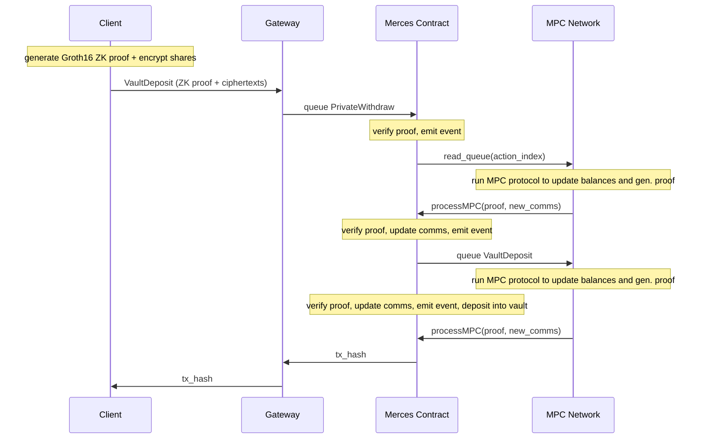
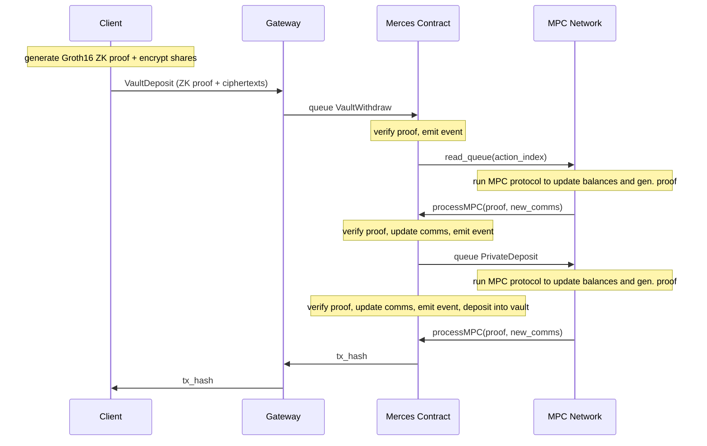

# How it works

Private Yield builds directly on Merces private balances. This page explains the vault mechanics,
walks through a vault deposit and withdrawal end-to-end.

:::tip Token support
For simplcity, the following description refers always to one token (USDT). The vault standard and Merces Private Yield support any custom token.
:::

## Components

**Private balance.** A user's Merces account, where USDT is held as secret shares across the MPC
network. This is the source for vault deposits and the destination for vault withdrawals.

**Vault contract.** An [ERC-4626](https://eips.ethereum.org/EIPS/eip-4626) contract deployed onchain. It tracks the total pool of underlying
assets and issues vault shares (vUSDT) proportional to each deposit. The conversion rate between
shares and assets increases over time as yield is added.

**MPC network.** A committee of node operators that hold vault balances as secret shares, just
as they hold private transfer balances. No single operator ever sees a user's vault share count or
its redemption value.

**Gateway.** The offchain coordinator that receives vault deposit and withdrawal requests,
orchestrates the ZK proof generation and MPC update flow, and returns the transaction hash once
the operation is finalised.

## Vault deposit

A vault deposit moves funds from a user's private USDT balance into the private vault. The
operation is atomic from the user's perspective: private balance decreases, vault share balance
increases.

### What happens under the hood

1. The client generates a **ZK proof** and encrypted shares that are sent to the gateway via WebSocket.
2. The gateway submits the transaction to the Merces contract.
3. The MPC Network processes the transition and withdraws the amount from the user's private balance.
4. When the withdraw is processed by the Merces contract, it queues a new transaction to deposit the amount into the vault.
5. The MPC Network processes the vault deposit, which updates the user's vault share balance.
6. Once the vault deposit is processed, the gateway returns the transaction hash to the client.

## Vault withdrawal

A vault withdrawal redeems vUSDT shares and credits USDT back to the user's private balance.
Because the vault accrues yield over time, the returned USDT amount is greater than what was
originally deposited (proportional to how long the shares were held and the current APY).

### What happens under the hood

1. The client generates a **ZK proof** and encrypted shares that are sent to the gateway via WebSocket.
2. The gateway submits the transaction to the Merces contract.
3. The MPC Network processes the transition and redeems the amount converted to vault shares from the user's vault balance.
4. When the withdraw is processed by the Merces contract, it queues a new transaction to deposit the amount into the private balance.
5. The MPC Network processes the private deposit, which updates the user's private balance.
6. Once the private deposit is processed, the gateway returns the transaction hash to the client.

