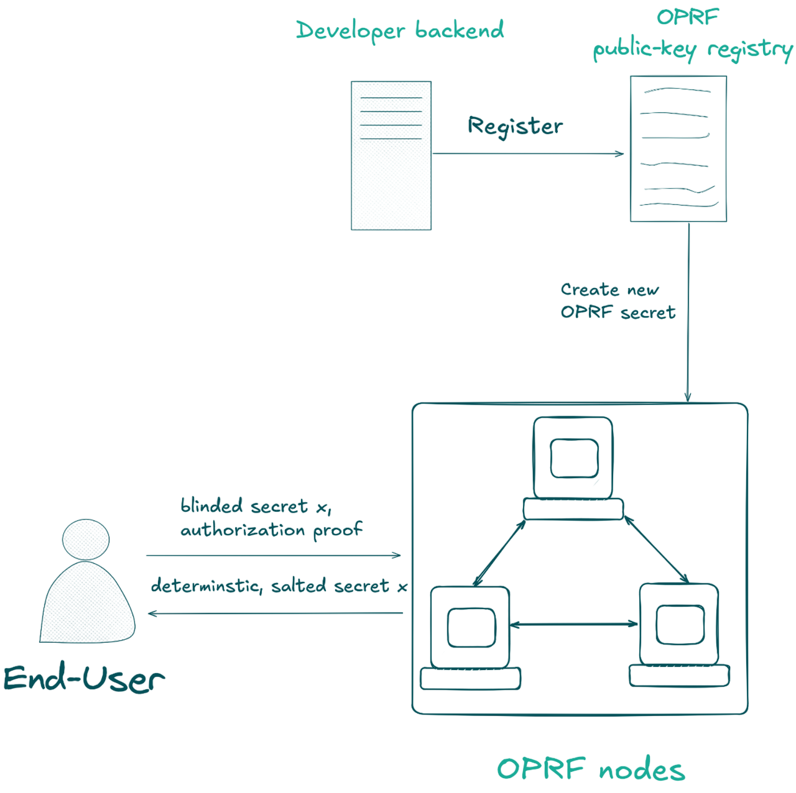

# Technical Concepts

Before diving into the implementation, it helps to understand what an OPRF is and how TACEO:OPRF extends it.

## What is a Pseudo-Random Function (PRF)?

A Pseudo-Random Function (PRF) is a deterministic function that produces outputs that look random to anyone who doesn't know the secret key.

In practice, PRFs are implemented using:
- Block ciphers (like ChaCha or AES)
- Hash-based constructions (such as HMAC)

Given a secret key `k` and an input `x`, a PRF deterministically computes:

```
F(k, x) → random-looking value
```

## What is an Oblivious PRF (OPRF)?

An Oblivious PRF (OPRF) is a special kind of PRF computed jointly by two parties:

- Client: Provides the input `x`
- Server: Holds the secret key `k` and evaluates the function

The key property is mutual privacy:
- Client never learns the key `k`
- Server never learns the input `x`

## How TACEO:OPRF Extends This

TACEO:OPRF builds on the OPRF design with threshold security:

- The secret key `k` is secret-shared across multiple parties
- No single party can evaluate the PRF alone
- A threshold of parties must cooperate
- Provides MPC trust guarantees while keeping inputs and keys private

### Architecture Overview

The TACEO:OPRF architecture consists of:

1. Independent OPRF nodes that hold shares of the OPRF secret key(s)
2. On-chain public registry of corresponding OPRF public keys  
3. Authorized accounts that can trigger secure key generation



## Standard Protocol Flow

Here's how a user interacts with TACEO:OPRF:

### 1. Query Generation
The user generates a blinded OPRF query and produces an authorization proof.

### 2. Node Processing  
OPRF nodes:
- Receive the query
- Verify the authorization proof
- Contribute with their key-share

### 3. Response Aggregation
The client:
- Receives responses from threshold-many nodes
- Combines answers into the full OPRF output

### 4. Optional Proof Generation
The client can prove valid OPRF execution in a ZK proof and submit both the output and proof to a verifier.

## Key Security Properties

### Privacy
- Input privacy: Your secrets are never revealed
- Key privacy: No single node knows the complete key
- Computational privacy: Intermediate steps remain hidden

### Integrity  
- Threshold security: Requires cooperation of multiple honest nodes
- Verifiable computation: Results can be proven without revealing inputs
- Authorization enforcement: Custom eligibility requirements

### Flexibility
- Custom authorization: Implement project-specific access control
- ZK-friendly design: Compatible with zero-knowledge proof systems
- Multi-use keys: Support multiple OPRF instances per authorization module

## Further Reading

For deeper technical details:
- [OPRF Systemization of Knowledge paper](https://eprint.iacr.org/2022/302.pdf)
- [TACEO technical writeup](https://github.com/TaceoLabs/oprf-service/blob/58c02f7df6e8d3d9721b2597008af12870df4926/docs/oprf.pdf)